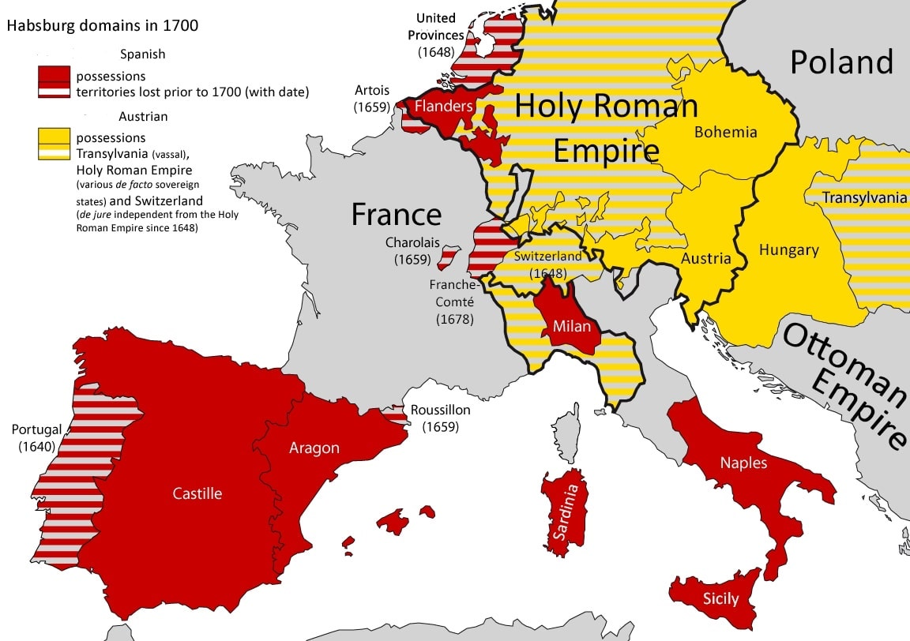

# Introduction

## Le système d’États

### Questions à explorer

Depuis 1648, le système international a longtemps été un système d’États.

1. Comment fonctionnent ces systèmes étatiques ?

   > Les systèmes étatiques fonctionnent sur la base de plusieurs principes fondamentaux :
   >
   > - **Souveraineté** : Chaque État est reconnu comme ayant le pouvoir suprême sur son territoire et ses affaires internes, sans ingérence extérieure.
   > - **Territorialité** : Les États ont des frontières définies et exercent leur autorité sur une zone géographique spécifique.
   > - **Égalité légale** : En théorie, tous les États sont égaux en droit international, même si le pouvoir réel varie considérablement.
   > - **Diplomatie et Traités** : Les relations entre États sont régulées par la diplomatie et des accords formels (traités, conventions).
   > - **Organisation Interne** : Chaque État dispose de ses propres institutions politiques, juridiques et administratives pour gouverner.
   >
   > Ces principes permettent la coexistence et la coopération entre différents États tout en maintenant un équilibre de pouvoir, souvent précaire, à l'échelle internationale.

2. Comment la société contemporaine des États est-elle devenue ce qu’elle est ?

   > La société contemporaine des États a évolué grâce à plusieurs facteurs historiques clés :
   >
   > - **Les traités de Westphalie (1648)** : Marquent le début de l'État-nation moderne en établissant la souveraineté territoriale et en mettant fin aux guerres de religion en Europe.
   > - **Colonialisme et Impérialisme** : Ont redessiné les frontières et créé des États-nations souvent artificiels, surtout en Afrique et en Asie, avec des impacts durables sur la structure politique mondiale.
   > - **Révolutions et Nationalisme** : Les révolutions américaine et française ont propagé les idées de souveraineté populaire et de nationalisme, influençant la formation des États modernes.
   > - **Guerres Mondiales** : Les deux guerres mondiales ont remodelé les frontières et les alliances internationales, conduisant à la création d'organisations internationales comme la Société des Nations puis l'ONU.
   > - **Guerre Froide** : A structuré le monde en blocs idéologiques, avec des alliances comme l'OTAN et le Pacte de Varsovie, influençant les relations internationales.
   > - **Globalisation** : La mondialisation économique, culturelle et technologique a interconnecté les États de manière sans précédent, tout en posant des défis à la souveraineté traditionnelle.

3. Comment peut-elle évoluer à l’avenir ?

   > L'évolution future du système international des États peut être influencée par plusieurs tendances et défis :
   >
   > - **Multipolarité** : La montée en puissance de nouvelles grandes puissances (comme la Chine et l'Inde) pourrait créer un système multipolaire, redistribuant le pouvoir global.
   > - **Institutions Internationales** : Le rôle des institutions internationales (ONU, OMC, FMI) pourrait se renforcer ou se réformer pour mieux répondre aux défis globaux comme le changement climatique, les pandémies et les inégalités.
   > - **Souveraineté vs Interdépendance** : Les États devront trouver un équilibre entre la préservation de leur souveraineté et la nécessité de coopérer sur des enjeux globaux.
   > - **Technologie et Cyberespace** : L'essor des technologies numériques et du cyberespace pourrait redéfinir les notions de frontière et de souveraineté.
   > - **Défis Environnementaux** : Le changement climatique et les crises environnementales pourraient forcer une coopération internationale accrue et la création de nouvelles structures de gouvernance globale.
   > - **Mouvements Sociaux et Démocratie** : Les mouvements pour la démocratie, les droits de l'homme et la justice sociale pourraient remodeler les systèmes politiques internes et les relations internationales.

Pour répondre, il faut avoir une idée de la manière dont d’autres sociétés ont fonctionné et se sont développées dans le passé. Quelles étaient les institutions, les postulats, les codes de conduite que les groupes d’entités politiques utilisaient dans le passé pour ordonner et réguler les systèmes qui les unissaient ?

> - **Cités-États Grecques** : Fonctionnaient avec des formes de gouvernance démocratique ou oligarchique, avec des alliances (ligues) et des rivalités constantes.
> - **Empire Romain** : Utilisait un système de provinces gouvernées par des représentants de Rome, avec un cadre légal unifiant l'empire.
> - **Système Féodal Européen** : Se caractérisait par une structure décentralisée de loyautés et obligations entre seigneurs et vassaux, régulée par la coutume et le droit féodal.
> - **Empires Asiatiques (Chine, Inde)** : Centralisation bureaucratique et administration sophistiquée, avec une importance accordée aux rituels et à la moralité confucéenne en Chine, et au dharma et à la politique arthashastrienne en Inde.
>   > Le dharma est un concept central dans les religions indiennes, y compris l'hindouisme, le bouddhisme, le jaïnisme et le sikhisme. Il désigne la loi cosmique et l'ordre moral qui régissent l'univers ainsi que les comportements individuels. Le dharma varie en fonction du contexte et des devoirs spécifiques à chaque individu, en fonction de sa caste (varna), de son stade de vie (ashrama) et de ses circonstances personnelles.
>   >
>   > La politique arthashastrienne tire son nom de l'Arthashastra, un ancien traité indien sur la politique, l'économie et la stratégie militaire, attribué à Kautilya (ou Chanakya), un conseiller du roi Chandragupta Maurya (4ème siècle avant notre ère).
> - **Confédérations et Tribus** : De nombreuses sociétés pré-modernes fonctionnaient sur des systèmes de confédérations (comme les Iroquois) ou de tribus avec des codes de conduite basés sur les traditions orales et le consensus.
>   > Les Iroquois, également connus sous le nom de Haudenosaunee ou le Peuple de la Longue Maison, sont un groupe de nations amérindiennes d'Amérique du Nord. Ils forment une confédération qui comprend historiquement six nations : les Mohawks, les Oneidas, les Onondagas, les Cayugas, les Senecas et, plus tard, les Tuscaroras.

- Le peuple amérindien
- Le sumérien
- La Chine ancienne
- La société européenne

> Les Sumériens, une ancienne civilisation de la Mésopotamie entre le Tigre et l'Euphrate, émergèrent vers 3500 av. J.-C. Ils ont développé une société avancée, avec une écriture cunéiforme, des cités-États prospères comme Ur et Uruk, et une riche mythologie. Leur héritage, qui inclut des avancées en agriculture, architecture et religion, a influencé de nombreuses cultures suivantes de la région.

### Les caractères du système d'États

Le système d’États que nous connaissons aujourd’hui est le résultat de la naissance, de l’expansion, de la connexion et de la fusion de la société européenne avec d’autres sociétés du monde. En d’autres termes, notre système mondial actuel repose sur des États souverains et juridiquement égaux, liés par des règles et des institutions complexes.

**États souverains** : Autorités politiques indépendantes (unitaires ou confédérées) qui ne reconnaissent aucun supérieur.

**Système** : les États reconnaissent la même prétention à l’indépendance que tous les autres membres du système. Le comportement de chacun d’eux est un élément nécessaire dans les calculs des autres.

**Société** : l’ensemble des règles, des institutions, des codes de conduite et des valeurs communes auxquels certains de ces États acceptent de se soumettre.

Le système international est un système d'anarchie ; il n'y a pas de gouvernement mondial au-dessus des États. Ce système est formé d'États et d'acteurs transnationaux, comme les entreprises multinationales, les organisations non gouvernementales (ONG) et les organisations internationales (OI). Le système international ressemble à une table de billard.

## Création du système d'État européen

Le système étatique européen a évolué pour devenir notre système mondial actuel. Certaines dates sont donc importantes pour les relations internationales :

| Années | Événements |
| --- | --- |
| 1648 | Traité de Westphalie |
| 1815 | Congrès de Vienne |
| 1919 | Congrès de Versailles |
| 1945 | Conférence de Yalta et Postdam |

> Pour comprendre l'évolution du système international actuel, il est crucial de considérer plusieurs événements historiques clés. En 1648, le Traité de Westphalie mit fin à la guerre de Trente Ans, établissant les principes de souveraineté étatique et de non-ingérence, posant ainsi les bases du système d'États modernes. Le Congrès de Vienne en 1815, après les guerres napoléoniennes, réorganisa l'Europe et instaura un équilibre des pouvoirs pour maintenir la paix. Le Congrès de Versailles en 1919, suivant la Première Guerre mondiale, redessina les frontières et créa la Société des Nations, visant à prévenir de futurs conflits. Enfin, les conférences de Yalta et de Potsdam en 1945, à la fin de la Seconde Guerre mondiale, réorganisèrent le monde et établirent les bases des Nations Unies, marquant ainsi le début de l'ordre mondial contemporain.

Il est nécessaire de considérer la guerre et la paix comme un continuum, une approche gradualiste, une mobilité pendulaire en fonction de l’intensité et de l’ampleur de la dislocation de l’ordre international.

Le pendule d'Adam Watson (École anglaise des Relations Internationales) :

> Le pendule d'Adam Watson est une métaphore développée par l'historien et théoricien des relations internationales Adam Watson, qui appartient à l'École anglaise des Relations Internationales. Cette métaphore décrit le mouvement oscillatoire entre deux pôles dans les systèmes internationaux : l'anarchie et la hiérarchie.
>
> Selon Watson, les systèmes internationaux ne sont jamais totalement anarchiques ni entièrement hiérarchiques ; ils oscillent entre ces deux extrêmes. L'anarchie représente un système où les États sont indépendants et égaux, sans autorité centrale, tandis que la hiérarchie décrit un système où certains États exercent une domination ou une influence significative sur les autres.
>
> Cette oscillation peut être influencée par divers facteurs, tels que les changements dans la distribution du pouvoir, les alliances, les guerres, les traités, et les institutions internationales. Le "pendule" de Watson aide à comprendre comment les relations internationales évoluent avec le temps et comment les dynamiques de pouvoir et d'influence entre les États peuvent changer en fonction des circonstances historiques et politiques.

### Les traités de Westphalie (1648)

Les traités de Westphalie, qui mettent fin à ==la guerre de Trente Ans==, entraînent avec eux la reconnaissance de la souveraineté des États, au détriment du pouvoir impérial, et donnent naissance, dans une certaine mesure, au système d'équilibre européen.

> La guerre de Trente Ans est un conflit majeur qui a ravagé l'Europe centrale entre 1618 et 1648. Elle a été l'un des plus destructeurs et des plus complexes conflits de l'histoire européenne, impliquant de nombreuses nations et ayant des ramifications politiques, religieuses et territoriales considérables.
>
> La guerre de Trente Ans a été déclenchée principalement par des tensions religieuses entre catholiques et protestants, ainsi que par des rivalités dynastiques et territoriales. Elle a commencé en 1618 lorsque des nobles protestants tchèques ont défenestré les représentants de l'empereur catholique du Saint-Empire romain germanique à Prague, un événement connu sous le nom de Défenestration de Prague.
>
> Le conflit s'est rapidement étendu à travers l'Europe, impliquant de nombreux États et pouvoirs régionaux, y compris l'Empire espagnol, la France, la Suède, le Danemark, et les Provinces-Unies (Pays-Bas). Il a été caractérisé par des batailles féroces, des sièges prolongés, et des dévastations généralisées, y compris des famines et des épidémies.
>
> La guerre de Trente Ans a pris fin en 1648 avec les traités de Westphalie, qui ont établi de nouveaux principes de souveraineté étatique et de relations internationales en Europe, marquant la fin de l'âge de la religion en tant que principal moteur des conflits européens et inaugurant une ère de diplomatie basée sur l'équilibre des pouvoirs.

La Westphalie est un traité communément considéré comme le premier accord international garantissant la souveraineté des États, avec des promesses de non-intervention entre eux et de séparation entre les mondes politique et religieux. La Westphalie permet à l’État moderne de compléter les points essentiels à son existence indépendante, avec des monopoles sur la violence légitime, les normes juridiques et les impôts.

> Les traités de Westphalie, signés en 1648 à Münster et à Osnabrück, mettent fin à la guerre de Trente Ans en Europe. Ils comprennent plusieurs accords qui ont des implications importantes pour la structure politique et religieuse de l'Europe. Voici quelques-uns de leurs principaux points :
>
> 1. Reconnaissance de l'indépendance des Provinces-Unies (Pays-Bas) vis-à-vis de l'Espagne.
> 2. Reconnaissance de l'indépendance de la Confédération suisse vis-à-vis du Saint Empire romain germanique.
> 3. Confirmation du principe de cuius regio, eius religio, permettant aux princes de choisir la religion de leur territoire.
> 4. Réorganisation du Saint Empire romain germanique en une mosaïque de territoires souverains, entraînant un affaiblissement du pouvoir impérial.
> 5. Établissement du concept de l'équilibre des pouvoirs en Europe, où aucune nation ne devrait dominer toutes les autres.
> 6. Reconnaissance du calvinisme comme une religion légitime.
> 7. Réglementation de la question des otages et des garanties de paix.
>
> Ces traités ont eu un impact durable sur la géopolitique européenne, contribuant à la consolidation d'un ordre international basé sur la souveraineté des États et l'équilibre des pouvoirs.

La Paix de Westphalie a inauguré le système européen des États et a ensuite défini la majorité des puissances nationales en Occident.

### La tentative hégémonique des Habsbourg

Le Saint Empire tente de réaliser sa unité, mais il est incapable de rassembler des forces pour lutter contre la France et la Suède. Après des réunions infructueuses en 1643, 1644 et 1645, le traité de paix de Westphalie fut défini en 1648.

Les plus grands bénéficiaires en Westphalie, la France et la Suède, parviennent à dissoudre le Saint-Empire romain germanique et à atténuer autant que possible le pouvoir de la famille Habsbourg.

*Comment la France et la Suède ont-elles bénéficié de la Westphalie ?*

> Les traités de Westphalie ont considérablement bénéficié à la France et à la Suède. La France a acquis des territoires stratégiques, notamment l'Alsace, renforçant ainsi ses frontières orientales et affaiblissant les Habsbourg. Ces gains territoriaux, combinés à la reconnaissance de la souveraineté des États, ont permis à la France d'accroître son influence en Europe et de s'affirmer comme une puissance dominante.
>
> La Suède, quant à elle, a obtenu des territoires importants en Allemagne, tels que la Poméranie occidentale, Wismar, Brême et Verden, consolidant ainsi sa position en tant que puissance majeure dans la région de la mer Baltique. De plus, en obtenant des sièges au sein du Conseil de l'Empire, la Suède a pu participer activement aux décisions politiques du Saint-Empire romain germanique, renforçant sa reconnaissance internationale et son influence politique en Europe.

*Qu'est-ce que les Habsbourg ?*

> Les Habsbourg étaient une dynastie européenne influente qui a dominé une grande partie de l'Europe centrale et occidentale pendant plusieurs siècles. Ils ont régné sur le Saint-Empire romain germanique, l'Autriche, l'Espagne et plusieurs autres territoires. Leur pouvoir a culminé aux XVIe et XVIIe siècles, lorsqu'ils contrôlaient des territoires vastes et variés allant de l'Europe centrale à l'Amérique latine. Les Habsbourg étaient connus pour leurs alliances matrimoniales stratégiques, qui ont renforcé leur influence politique et territoriale à travers l'Europe.

L'ordre des Habsbourg:

1. L’État français est devenu l’animateur et le leader d’une faible coalition anti-hégémonique;

   > La coalition anti-hégémonique dirigée par la France pendant le XVIIe siècle comprenait principalement des États européens préoccupés par l'expansionnisme des Habsbourg. Parmi ses membres figuraient la Suède, les Provinces-Unies (Pays-Bas) et d'autres États allemands et européens, souvent engagés dans des conflits territoriaux ou religieux avec les Habsbourg. Ensemble, ils cherchaient à affaiblir la domination des Habsbourg en Europe et à préserver un équilibre des pouvoirs sur le continent. En revanche, les principaux alliés des Habsbourg étaient l'Espagne, qui était le cœur de leur pouvoir en Europe occidentale, et le Saint-Empire romain germanique, dirigé par la maison des Habsbourg et soutenant son autorité impériale en Europe centrale.

2. France, la plus grande nation catholique, soutien les protestants;

   > Au XVIIe siècle, la France, alors dirigée par Louis XIV, a adopté une politique de soutien aux protestants dans le but de contrer l'expansionnisme des Habsbourg et de préserver son propre équilibre de pouvoir en Europe. Cette décision était motivée par des considérations politiques et géopolitiques plutôt que par des motifs religieux. En soutenant les protestants, qui étaient souvent en conflit avec les Habsbourg, la France pouvait affaiblir son principal rival en Europe et étendre son propre influence territoriale. De plus, en favorisant un certain équilibre entre les puissances catholiques et protestantes, la France espérait maintenir une stabilité relative sur le continent, favorisant ainsi ses propres intérêts politiques et territoriaux.

3. L’accord de Westphalie était la Charte d’une Europe organisée en permanence sur la base d’un principe anti-hégémonique;

4. La société européenne des États est née de la lutte entre les forces qui tendaient vers un ordre hégémonique et celles qui ont réussi à amener la nouvelle Europe vers l’extrémité du pendule d'Adam Watson, là où se situe l’indépendance.

### Richelieu et l'alliance anti-hégémonique

Au XVIe siècle, les Habsbourg adoptaient une vision hégémonique. Dans la première moitié du XVIIe siècle, l'État français cherche une autre conception grandiose, face aux Habsbourg fatigués et affaiblis : la conception anti-hégémonique. Cette conception attribuait à la France la gestion de la coalition anti-Habsbourg. Son principal architecte fut le premier ministre de Louis XIII : le cardinal Richelieu.

> Armand Jean du Plessis, cardinal de Richelieu, était un homme d'État français du XVIIe siècle. Il a été l'un des principaux conseillers de Louis XIII et est devenu célèbre pour son rôle central dans la politique intérieure et extérieure de la France pendant son époque. Richelieu est surtout connu pour avoir consolidé le pouvoir royal aux dépens de la noblesse et pour avoir mené une politique étrangère visant à affaiblir les Habsbourg et à promouvoir les intérêts de la France en Europe. Il a également été un protecteur des arts et des lettres, contribuant à l'établissement de l'Académie française. Son influence politique et son pragmatisme ont laissé une marque indélébile sur l'histoire de la France et de l'Europe du XVIIe siècle.

objectifs: raison d'État

1. unifier la France sous un monarque absolu;
2. détruire toute opposition efficace;
3. la justification de toute politique, y compris le recours à la force et à la fraude.

La coalition franco-protestante a coordonné et structuré les forces opposées à l'hégémonie des Habsbourg dans la chaotique première moitié du XVIIe siècle, avant qu'un nouvel ordre général ne soit négocié et mis en pratique.

La guerre de Trente Ans a abouti à une solution anti-hégémonique qui a empêché la concentration de la puissance allemande dans un seul État, mais a permis une concentration de la puissance française. Le cardinal Richelieu avait la capacité stratégique d'empêcher ses plus grands rivaux, l'Espagne et l'Autriche, d'établir leur contrôle sur les territoires qui forment aujourd'hui l'Allemagne et l'Europe centrale. La guerre de Trente Ans ne prend fin qu'au début du long règne de Louis XIV et de son chancelier Mazarin. La France, dirigée par le cardinal Mazarin, souhaite obtenir du Congrès de Westphalie la sécurité de ses frontières du côté espagnol et du côté du Saint-Empire.

Le rejet par les Habsbourg d'une raison d'État espagnole signifiait que les intérêts de l'État espagnol étaient sacrifiés au profit des buts et des intérêts de la famille Habsbourg. L’Espagne a payé le prix d’une politique étrangère fondée sur des principes généraux plutôt que sur les intérêts nationaux. La dévastation de l’Allemagne fut encore plus grave.

> La politique étrangère des Habsbourg, en particulier celle menée par l'Espagne, était souvent motivée par les intérêts dynastiques plutôt que nationaux. Par exemple, durant la guerre de Trente Ans, l'Espagne a sacrifié ses ressources pour soutenir les buts de la famille Habsbourg, ce qui a entraîné des conséquences désastreuses pour l'Espagne, y compris des difficultés économiques et des pertes humaines.

## Le principal d'équilibre

LEÇON NUMÉRO 01 : Au sein d’un système international, les principes ne sont pas si importants. il est nécessaire d’observer l’équilibre des pouvoirs entre les puissances. Si une puissance commence à devenir hégémonique, il est nécessaire que les autres puissances plus faibles créent un réseau d’alliances contre la puissance montante. Ce mécanisme est dû au dilemme de sécurité. (John Herz)

> John H. Herz était un politologue américain, né en 1908 et décédé en 2005, connu pour ses contributions à la théorie des relations internationales. Il est notamment célèbre pour avoir développé le concept de "sécurité collective" dans son ouvrage "Political Realism and Political Idealism" publié en 1951. Herz a également étudié les aspects psychologiques et perceptifs des relations internationales, explorant comment les perceptions des acteurs étatiques influencent leurs politiques étrangères et les relations entre les États. Ses travaux ont eu une influence significative sur le domaine des relations internationales et continuent d'être étudiés et discutés aujourd'hui.

Le politologue Raymond Aron a expliqué le principe général de la politique d'équilibre :

« Au plus haut niveau d'abstraction, la politique d'équilibre se réduit à la manœuvre destinée à empêcher un État d'accumuler des forces supérieures à celles de ses rivaux alliés. Chaque État, s'il veut sauvegarder l'équilibre, prendra position contre l'État ou la coalition qui semble capable de maintenir une telle supériorité. Il s'agit d'une règle générale valable pour tous les systèmes internationaux. »

> Raymond Aron était un intellectuel français majeur du XXe siècle, dont les contributions dans les domaines de la philosophie politique et des relations internationales ont eu un impact durable. Sa pensée, marquée par un pragmatisme réaliste, a fait de lui un critique éminent de la politique étrangère française et un défenseur de la réalpolitik. Son œuvre la plus célèbre, "Paix et Guerre entre les Nations", publiée en 1962, explore les dynamiques des conflits internationaux et les tensions entre la puissance et la morale dans les affaires internationales. En tant que journaliste, Aron a également exercé une influence significative, contribuant à façonner le débat politique et intellectuel en France.

Accords de Westphalie : légitimation d’une communauté d’États souverains, de nouvelles règles et institutions remplacent les anciennes, contribuant encore aujourd’hui à façonner le système international.

> Avant les traités de Westphalie en 1648, les relations internationales en Europe étaient caractérisées par plusieurs éléments distincts :
>
> 1. **Système féodal** : Les relations étaient souvent régies par des liens féodaux, où les seigneurs et les vassaux avaient des obligations mutuelles de loyauté et de service. Les alliances étaient souvent personnelles et dynastiques plutôt que basées sur des États-nations.
>
> 2. **Pouvoirs impériaux et papaux** : L'Empire romain germanique, dirigé par l'empereur, jouait un rôle central en Europe, tout comme le pape qui avait une autorité spirituelle significative sur les royaumes chrétiens. Ces deux institutions influençaient fortement la politique européenne et pouvaient intervenir dans les affaires des différents royaumes.
>
> 3. **Absence de souveraineté étatique claire** : Les frontières étaient souvent floues et contestées, et l'idée moderne de souveraineté étatique n'existait pas encore pleinement. Les territoires changeaient fréquemment de mains à travers les mariages, les héritages et les guerres.
>
> 4. **Guerres de religion** : Les conflits religieux, notamment entre catholiques et protestants, étaient fréquents et influençaient fortement les relations internationales. Les alliances étaient souvent formées en fonction des affiliations religieuses plutôt que des intérêts nationaux.
>
> 5. **Alliances dynastiques** : Les mariages entre maisons royales jouaient un rôle crucial dans la formation d'alliances et de coalitions. Les dynasties régnaient sur des territoires dispersés, et les relations internationales étaient souvent une extension des intérêts familiaux.
>
> Les traités de Westphalie ont transformé ce paysage en établissant des principes de souveraineté étatique, où chaque État était reconnu comme ayant le droit de gouverner ses affaires sans ingérence extérieure, et en créant un cadre plus stable et juridique pour les relations internationales.

1. L’équilibre des pouvoirs;
2. le droit international;
3. la diplomatie;
4. la guerre;
5. les grandes puissances.

Jusqu’au XXe siècle, les normes établies en Westphalie déterminaient la logique de la souveraineté mondiale.
